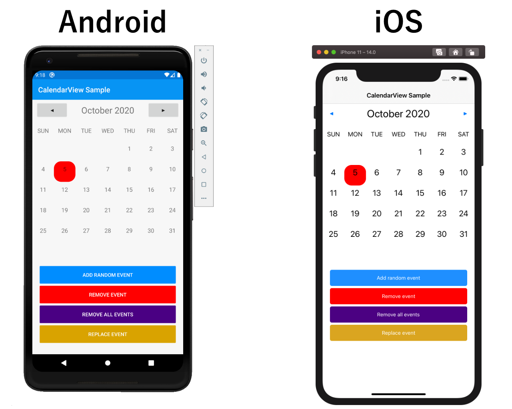

# Xalendar [](https://codecov.io/gh/ionixjunior/Xalendar)


Xalendar is a calendar view for Xamarin.Forms applications. This plugin is under development.



## Getting Started

Install Xalendar using NuGet with the following command line to your shared library project.

```console
> dotnet add package Xalendar --version 0.0.1-pre
```

To use the Xalendar component, you'll need to add the following namespace to the top of your XAML views.

```xml
xmlns:xalendar="http://xalendar.com/schemas/xaml"
```

In context of a XAML `ContentPage` definition.

```xml
<ContentPage
    Title="CalendarView Sample"
    x:Class="Xalendar.Sample.MainPage"
    xmlns="http://xamarin.com/schemas/2014/forms"
    xmlns:local="clr-namespace:Xalendar.Sample"
    xmlns:x="http://schemas.microsoft.com/winfx/2009/xaml"
    xmlns:xalendar="http://xalendar.com/schemas/xaml">
```


To use the component in your XAML view, you can then define an instance with the following markup.

```xml
<xalendar:CalendarView Events="{Binding Events}" />
```

The `Events` property is a collection of events on the ViewModel. Events are **not** the C# `Event` class, but instead a logical concept of an event (date and time).

```c#
public ObservableCollection<ICalendarViewEvent> Events { get; }
```

## Contributors

- Pedro Jesus [@pictos](https://github.com/pictos)
- Felipe Baltazar [@felipebaltazar](https://github.com/felipebaltazar)
- Khalid Abuhakmeh [@khalidabuhakmeh](https://github.com/khalidabuhakmeh)
- Brendon Barreto [@brendonbarreto](https://github.com/brendonbarreto)
