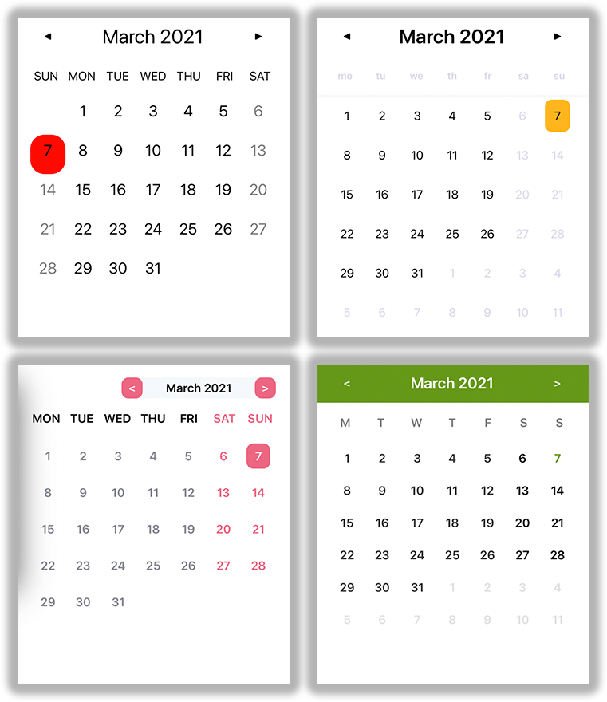

# Xalendar

[](https://codecov.io/gh/ionixjunior/Xalendar)

Xalendar is a calendar view for Xamarin.Forms applications. This plugin is under development.




## Getting Started

Install Xalendar using NuGet with the following command line to your shared library project.

```console
> dotnet add package Xalendar --version 0.0.1-pre
```

## Documentation

Check out the documentation [here](https://github.com/ionixjunior/Xalendar/wiki).

## There are a bunch of other calendar view components. So, why was the Xalendar developed?

The purpose of the Xalendar development was to share knowledge and teach the people of the community how we can start, develop, manage and deploy this kind of software. All of the development of this component is on a [YouTube playlist](https://www.youtube.com/playlist?list=PL6M6J_6V_um_QM-WF9MfNAD7X2qGBTXdL) and in a [Twitch channel](https://www.twitch.tv/ionixjunior). 

## Contributors

- Pedro Jesus [@pictos](https://github.com/pictos)
- Felipe Baltazar [@felipebaltazar](https://github.com/felipebaltazar)
- Khalid Abuhakmeh [@khalidabuhakmeh](https://github.com/khalidabuhakmeh)
- Brendon Barreto [@brendonbarreto](https://github.com/brendonbarreto)
